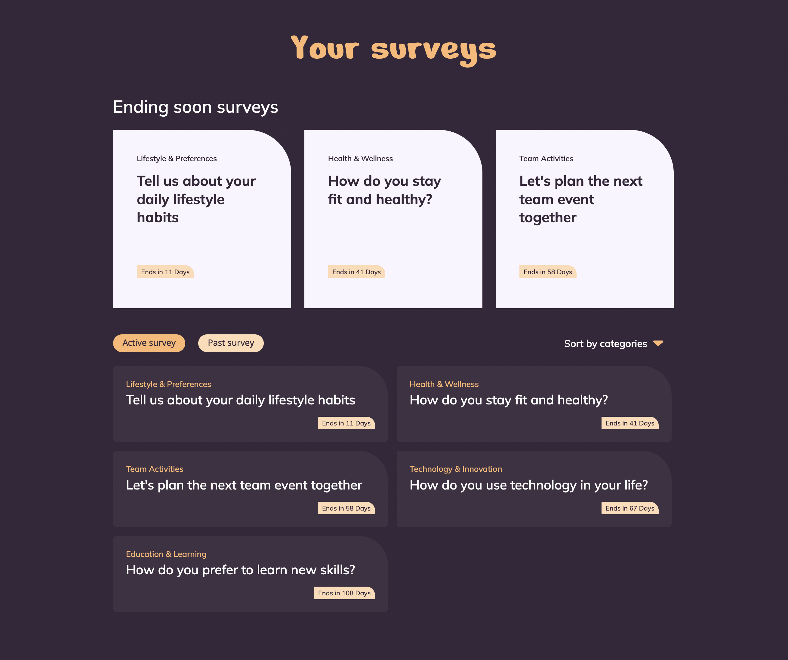
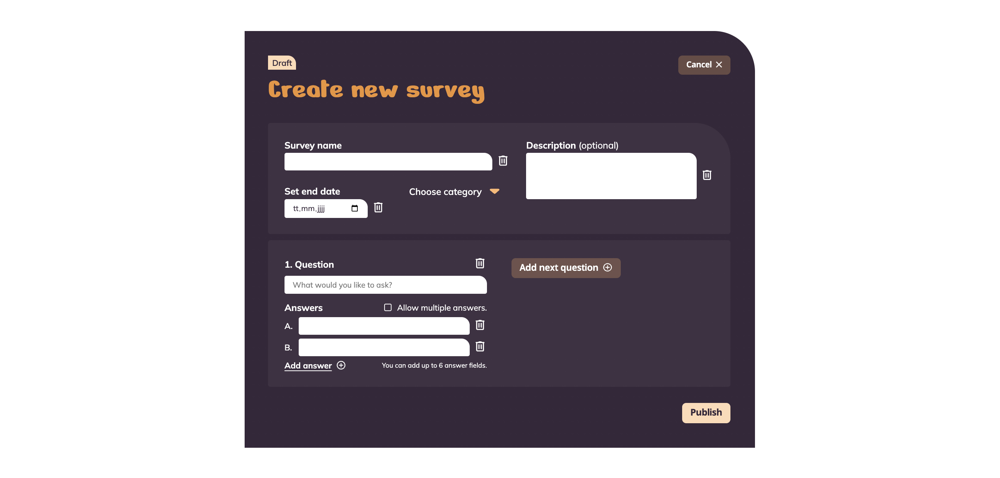
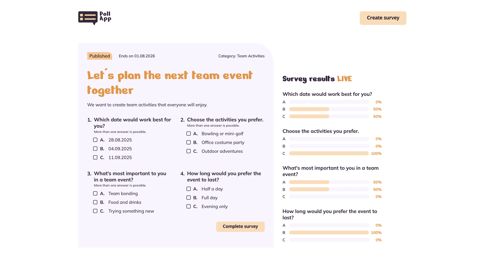

<h1 align="left">Poll App</h1>

###

PollApp is an Angular app for creating, sharing, and analyzing surveys in real time. Supabase was used as the backend for authentication and data storage. 

This app is part of the Developer Akademie's training programme for software developers (www.developerakademie.com). 
  

###

 
 
 
